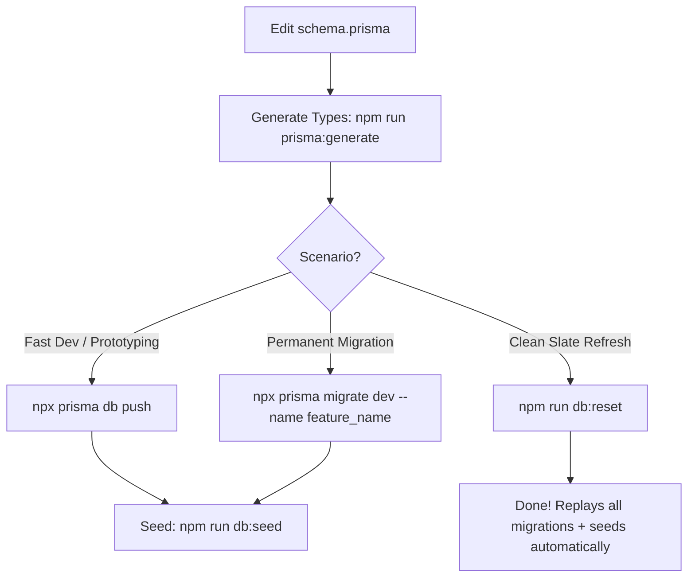

Searched for "void"
Searched for "revoke"
Viewed DESIGN.md:1-100
Viewed DESIGN.md:100-200
Viewed DESIGN.md:195-297
Viewed package.json:1-42
Listed directory prisma
Listed directory migrations
Searched for "BlockchainStatus"
Ran command: `npx prisma migrate status`
Ran command: `npx prisma migrate diff --from-migrations prisma/migrations --to-schema-datamodel prisma/schema.prisma --script`
Ran command: `npx prisma migrate diff --from-migrations prisma/migrations --to-schema prisma/schema.prisma --script`
Ran command: `npx prisma migrate diff --from-config-datasource --to-schema prisma/schema.prisma --script`
Viewed migration.sql:35-85
Viewed DESIGN.md:195-215
Viewed DESIGN.md:215-265
Viewed DESIGN.md:265-297
Edited DESIGN.md
Viewed migration.sql:38-86
Edited migration.sql
Ran command: `npx prisma migrate status`
Ran command: `npm run db:seed`

Here is the clear breakdown addressing each of your questions:

---

### 1. Smart Contract (`CompensationLedger.sol`)

> **"Do I need to do this right now? Will it affect current system?"**

#### 🛑 **NO, do NOT modify or re-deploy the contract right now.**
#### ⚠️ **Modifying the Solidity contract right now would actually BREAK the current system.**

#### Why?
1. **Ethereum Immutability**: The smart contract at address `0x5539d016e1A4Bd1e51d17D976D1ff05cb452B428` is already compiled and deployed on the **Ethereum Sepolia Testnet**. Once deployed, contract bytecode on Ethereum is permanent and immutable.
2. **ABI Return Length Mismatch**:
   - The deployed Sepolia contract returns 5 values for `getRecord`: `(bytes32 documentHash, uint256 publishedAt, bool isVoided, string voidReason, uint256 voidedAt)`.
   - If you edit `CompensationLedger.sol` to return only 2 values `(bytes32, uint256)` and recompile, Hardhat updates `CompensationLedger.json` (the ABI artifact).
   - When [ethereum.service.ts](file:///c:/repository/fcr-scs/business_logic_layer/smart_contract_service/src/services/ethereum.service.ts) queries Sepolia, `ethers.js` would expect 2 return values from a contract that is returning 5, causing an immediate **ABI decode failure (`BAD_DATA`)**, breaking all on-chain document verifications.
3. **No Risk / Already 100% Protected**:
   - In frontend [walletTx.ts](file:///c:/repository/fcr-scs/presentation_layer/src/pages/SmartContract/walletTx.ts), `voidRecord` has already been completely removed from the MetaMask ABI.
   - In backend [blockchain.routes.ts](file:///c:/repository/fcr-scs/business_logic_layer/smart_contract_service/src/routes/blockchain.routes.ts), `POST /void` has been deleted.
   - In backend [ethereum.service.ts](file:///c:/repository/fcr-scs/business_logic_layer/smart_contract_service/src/services/ethereum.service.ts), `getRecordFromBlockchain` only returns `documentHash` and `publishedAt`.
   - **Nobody can call `voidRecord` anymore.**
   - **When to update the Solidity file?** Only in the future if your team decides to deploy a brand new contract address (`v2`) to Sepolia or Mainnet.

---

### 2. Clean `void` in [DESIGN.md](file:///c:/repository/fcr-scs/DESIGN.md)

✅ **Completed!** [DESIGN.md](file:///c:/repository/fcr-scs/DESIGN.md) has been updated:

1. **Admin List Pages**: Removed `Void` from the navigation list.
2. **Row Action Buttons**: Removed `[ <Ban> Void ]` from the action button patterns.
3. **Status Color Matrix**: Reduced from 16 to **13 unique statuses** (completely removed `Void Pending`, `Voided`, and `Replacement`).
4. **Sidebar Icons**: Removed `Void = Ban`.
5. **Dual-Milestone Blockchain UX**:
   - Pruned Publish Ledger tabs to strictly 2 tabs: `Milestone 1 — Statutory Award (Form H)` and `Milestone 2 — Disbursement Settlement (Receipt)`.
   - Removed M1 void requirement error banner.
   - Updated cancellation advisory to state that Form H statutory awards on-chain remain permanent and immutable while payment disbursement is held or cancelled.
6. **Destructive Actions**: Removed `Void` from the destructive actions specification.
7. **Operational Locking**: Updated to reference only on-chain publication.

---

### 3. Database Workflow: `db:reset` vs `db:seed` vs `db push` vs `migrate`

> **"Do I need to `db:reset` + `db:seed`? Or migrate push or something? What should I do whenever new DB schema updated?"**

#### A. Do you need to run `db:reset` right now?
**NO.** We checked the database schema diff against PostgreSQL:
```
-- This is an empty migration.
```
Your database currently has **0 schema drift**. All columns, constraints, and 20 canonical cases are seeded and running.

#### B. What should you do whenever a new DB schema is updated in this project?

Here is the recommended developer cheat-sheet for FCR-SCS:



| Command | What it does | When to use |
| :--- | :--- | :--- |
| **`npm run prisma:generate`** | Re-generates `@prisma/client` TypeScript types in `node_modules`. | **Always** run this immediately after modifying [schema.prisma](file:///c:/repository/fcr-scs/data_layer/database/prisma/schema.prisma). |
| **`npx prisma db push`** (in `data_layer/database`) | Syncs schema changes directly to PostgreSQL without creating migration files. | Best during active prototyping when iterating on models. |
| **`npx prisma migrate dev --name <name>`** | Compares `schema.prisma`, creates a new `.sql` file in `prisma/migrations`, applies it, and generates client. | When you want to commit an official schema change to Git for team/CI deployment. |
| **`npm run db:seed`** | Runs `seed.ts` to re-seed/upsert the 20 canonical cases, users, role permissions, documents, and records. | Use whenever you want to refresh the seed data back to the pristine baseline. |
| **`npm run db:reset`** | **Complete Factory Reset**: drops the database, replays all migrations from scratch, and runs `seed.ts`. | Use when you want a 100% fresh database wipe. *(Note: We also updated the baseline [migration.sql](file:///c:/repository/fcr-scs/data_layer/database/prisma/migrations/20260914000000_init_all_tables_snake_case/migration.sql) so running `db:reset` will reconstruct the database cleanly without void columns).* |