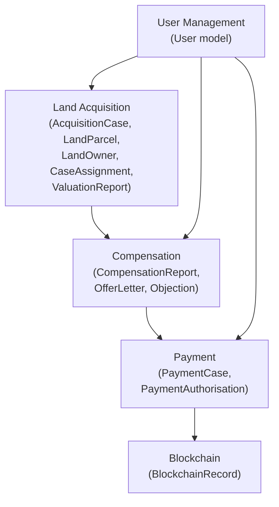

# Implementation Plan: Land Acquisition & Compensation Backend Integration

> Complete roadmap for integrating the **Presentation Layer**, **Business Logic Layer**, and **Data Layer** for the Land Acquisition Management and Compensation Management modules.

---

## Part 1 — Current Project Analysis

### 1.1 Architecture Overview

The project follows a **three-layer Modular Monolith** architecture:

| Layer | Technology | Description |
|---|---|---|
| **Presentation Layer** | React 19, TypeScript, Vite, Tailwind CSS, GSAP | Frontend SPA at `presentation_layer/` |
| **Business Logic Layer** | Node.js, Express, TypeScript | Unified server at `business_logic_layer/server.ts` on port 3030 |
| **Data Layer** | PostgreSQL, Prisma ORM v7 (`@prisma/adapter-pg`) | Schema at `data_layer/database/prisma/schema.prisma` |

All backend modules export Express `Router` instances mounted on a single server. Frontend makes HTTP calls to `http://localhost:3030/api/*`.

### 1.2 Completed Modules

| Module | Presentation | Business Logic | Data Layer | Status |
|---|---|---|---|---|
| Payment Service | ✅ 6 pages | ✅ Controllers, Services, Routes | ✅ PaymentCase, PaymentAuthorisation, PaymentReceipt, FailedTransaction, ReceiverBankDetails | **Fully Implemented** |
| Smart Contract / Blockchain | ✅ 4 pages | ✅ Controllers, Services, Routes | ✅ BlockchainRecord | **Fully Implemented** |
| Land Acquisition | ✅ **7 pages built** | ❌ **Empty** (`.gitkeep` only) | ✅ **Schema defined** (Project, AcquisitionCase, LandParcel, LandOwner, LandOwnership, CaseAssignment, ValuationReport, CaseDocument) | **Frontend + Schema only** |
| Compensation | ✅ **11 pages built** | ❌ **Empty** (`.gitkeep` only) | ✅ **Schema defined** (CompensationReport, OfferLetter, Objection, ObjectionDocument) | **Frontend + Schema only** |
| User Management | ❌ | ❌ Empty | ✅ User model defined | **Schema only** |
| AI Prediction | ✅ Pages built | ❌ Empty | ❌ | **Frontend only** |
| Reporting | ✅ Pages built | ❌ Empty | ❌ | **Frontend only** |

### 1.3 Missing Components

> [!IMPORTANT]
> The Land Acquisition and Compensation modules have **complete frontend pages** and **complete database schemas** but have **zero backend business logic**. No controllers, services, routes, or repository files exist.

**Missing for Land Acquisition:**
- `land_acquisition_service/src/controllers/` — all controllers
- `land_acquisition_service/src/services/` — all services
- `land_acquisition_service/src/routes/` — all route definitions
- `land_acquisition_service/src/prisma.ts` — Prisma client instance
- `land_acquisition_service/src/index.ts` — module entry point
- Route mounting in `server.ts`

**Missing for Compensation Management:**
- `compensation_management_service/src/controllers/` — all controllers
- `compensation_management_service/src/services/` — all services
- `compensation_management_service/src/routes/` — all route definitions
- `compensation_management_service/src/prisma.ts` — Prisma client instance
- `compensation_management_service/src/index.ts` — module entry point
- Route mounting in `server.ts`

### 1.4 Dependencies Between Modules



- **Compensation depends on Land Acquisition**: `CompensationReport` references `AcquisitionCase` and `ValuationReport`.
- **OfferLetter depends on Compensation AND Land Acquisition**: references `CompensationReport`, `AcquisitionCase`, and `LandOwnership`.
- **Objection depends on OfferLetter**: references `OfferLetter` and `AcquisitionCase`.
- **All modules depend on User**: every model has `createdById` referencing `User`.

### 1.5 Design Observation — Inconsistency Noted

> [!WARNING]
> **Inconsistency**: The Payment module's Prisma schema uses **string-based status fields** (e.g., `status String @default("Approved")`), while the Land Acquisition / Compensation schema uses **Prisma enums** (`CaseStatus`, `OfferStatus`, `ReportStatus`, `ObjectionStatus`). The new modules should follow the **enum-based approach** consistently since it provides type safety and aligns with the defined schema.

> [!WARNING]
> **Inconsistency**: The Payment module's `bank-details.controller.ts` directly imports `prisma` and queries the database, bypassing the service layer. The new modules should **always route through the service layer** for consistency.

---

## Part 2 — Workflow Mapping

### 2.1 Land Acquisition Module

#### Page: CaseDashboard (Case Management Dashboard)

```
User clicks "Case Management" in sidebar
  ↓
Presentation Layer: GET /api/land-acquisition/cases?status=&search=&page=&limit=
  ↓
Business Logic Layer:
  → CaseController.getAllCases()
  → CaseService.getAllCases(filters)
  ↓
Data Layer:
  → prisma.acquisitionCase.findMany({ where, include, skip, take, orderBy })
  → Joins: Project, LandParcel, CaseAssignment (for assigned valuer)
  ↓
Database: acquisition_case, project, land_parcel, case_assignment tables
  ↓
Response: { cases: [...], total, page, limit }
```

**Stats endpoint:**
```
GET /api/land-acquisition/cases/stats
  → CaseController.getCaseStats()
  → CaseService.getCaseStats()
  → prisma.acquisitionCase.groupBy({ by: ['status'], _count: true })
  → Returns: { totalCases, active, completed, pendingAction, totalCompensation }
```

#### Page: CaseRegistration (Register New Case)

```
User fills 4-step wizard (Project → Land → Owners → Documents) and clicks "Submit Case"
  ↓
Presentation Layer: POST /api/land-acquisition/cases
  Request Body: { project: {...}, land: {...}, owners: [...], documents: [...] }
  ↓
Business Logic Layer:
  → CaseController.createCase()
  → Validation: required fields, data types, GPS coordinates
  → CaseService.createCase(data)
  ↓
Data Layer (Transaction):
  → prisma.$transaction([
      prisma.project.upsert(...)          // Step 1: Create/Find Project
      prisma.acquisitionCase.create(...)   // Step 2: Create Case (status: CASE_REGISTERED)
      prisma.landParcel.create(...)        // Step 3: Create Land Parcel
      prisma.landOwner.createMany(...)     // Step 4: Create Land Owners
      prisma.landOwnership.createMany(...) // Step 5: Create Ownerships
      // Step 6: Upload documents (handle via multipart)
      prisma.caseDocument.createMany(...)
    ])
  ↓
Database: project, acquisition_case, land_parcel, land_owner, land_ownership, case_document
  ↓
Response: { case: { caseId, status: 'CASE_REGISTERED', ... } }
```

#### Page: CaseDetails (View/Edit Case)

```
User clicks a case row in the dashboard
  ↓
Presentation Layer: GET /api/land-acquisition/cases/:caseId
  ↓
Business Logic Layer:
  → CaseController.getCaseById()
  → CaseService.getCaseById(caseId)
  ↓
Data Layer:
  → prisma.acquisitionCase.findUnique({
      where: { caseId },
      include: {
        project: true,
        landParcel: { include: { ownerships: { include: { landOwner: true } } } },
        caseDocuments: true,
        valuationReports: true,
        compensationReports: true,
        offerLetters: true
      }
    })
  ↓
Response: { case: { ...fullCaseDetails } }
```

**Delete Case:**
```
DELETE /api/land-acquisition/cases/:caseId
  → CaseController.deleteCase()
  → CaseService.deleteCase(caseId) // Validate: only CASE_REGISTERED status
  → prisma.acquisitionCase.delete({ where: { caseId } }) // with cascade
```

**Update Case:**
```
PUT /api/land-acquisition/cases/:caseId
  → CaseController.updateCase()
  → CaseService.updateCase(caseId, data)
  → prisma.$transaction([...updates])
```

#### Page: CaseAssignment (Assign Valuer)

```
User selects unassigned case + valuer + acceptance period → clicks "Confirm Assignment"
  ↓
Presentation Layer: POST /api/land-acquisition/assignments
  Body: { caseId, valuerId, acceptancePeriodDays }
  ↓
Business Logic Layer:
  → AssignmentController.assignValuer()
  → Validation: case exists, status is CASE_REGISTERED, valuer exists, no existing assignment
  → AssignmentService.assignValuer(data)
  ↓
Data Layer (Transaction):
  → prisma.$transaction([
      prisma.valuationReport.create({ caseId, valuerId, reportStatus: 'PENDING' })
      prisma.caseAssignment.create({ caseId, assignedToId: valuerId, dueDate, valuationReportId })
      prisma.acquisitionCase.update({ status: 'VALUER_ASSIGNED' })
    ])
  ↓
Response: { assignment: { assignmentId, caseId, valuerName, status: 'Pending Acceptance' } }
```

**Get Unassigned Cases:**
```
GET /api/land-acquisition/cases/unassigned
  → CaseController.getUnassignedCases()
  → CaseService.getUnassignedCases()
  → prisma.acquisitionCase.findMany({ where: { status: 'CASE_REGISTERED', caseAssignments: { none: {} } } })
```

**Get Available Valuers:**
```
GET /api/land-acquisition/valuers
  → ValuerController.getAvailableValuers()
  → ValuerService.getAvailableValuers()
  → prisma.user.findMany({ where: { role: 'LAND_VALUER', isActive: true } })
```

#### Page: ValuationReportDashboard

```
GET /api/land-acquisition/valuation-reports?status=&search=&page=&limit=
  → ValuationController.getAllReports()
  → ValuationService.getAllReports(filters)
  → prisma.valuationReport.findMany({
      where, include: { acquisitionCase: true, valuer: true }, orderBy, skip, take
    })
```

#### Page: ValuationReportGenerator

```
POST /api/land-acquisition/valuation-reports
  Body: { caseId, valuationMethod, marketValue, recommendedCompensation, remarks }
  + multipart files: buildingAssessment, siteInspection
  ↓
  → ValuationController.createReport()
  → Validation: case status must be VALUER_ASSIGNED or VALUATION_IN_PROGRESS
  → ValuationService.createReport(data)
  ↓
  → prisma.$transaction([
      prisma.valuationReport.update({
        where: { reportId }, data: { valuationMethod, marketValue, recommendedCompensation, remarks, reportStatus: 'PENDING' }
      })
      prisma.acquisitionCase.update({ status: 'PENDING_VALUATION_APPROVAL' })
    ])
```

#### Page: ValuationReportReview

```
POST /api/land-acquisition/valuation-reports/:reportId/approve
  → ValuationController.approveReport()
  → ValuationService.approveReport(reportId, reviewerId)
  → prisma.$transaction([
      prisma.valuationReport.update({ reportStatus: 'APPROVED' })
      prisma.acquisitionCase.update({ status: 'VALUATION_APPROVED' })
    ])

POST /api/land-acquisition/valuation-reports/:reportId/reject
  Body: { reason, acceptancePeriodDays }
  → ValuationController.rejectReport()
  → ValuationService.rejectReport(reportId, reason, days)
  → prisma.$transaction([
      prisma.valuationReport.update({ reportStatus: 'REJECTED', remarks: reason })
      prisma.acquisitionCase.update({ status: 'VALUATION_REJECTED' })
    ])
```

---

### 2.2 Compensation Module

#### Page: CompensationReportList (Dashboard)

```
GET /api/compensation/reports?status=&search=&page=&limit=
  → CompensationController.getAllReports()
  → CompensationService.getAllReports(filters)
  → prisma.compensationReport.findMany({
      include: { acquisitionCase: true, valuationReport: true }
    })
```

#### Page: CompensationReportGenerator

```
POST /api/compensation/reports
  Body: { caseId, valuationReportId, components: { landValue, buildingValue, cropValue, businessDisruption, disturbanceCompensation, relocationAllowance, otherEligible } }
  ↓
  → CompensationController.createReport()
  → Validation: case status is VALUATION_APPROVED, valuation report exists and approved
  → CompensationService.createReport(data)
  → Business Rules:
    1. Calculate total = sum of all components
    2. If total >= 1,000,000: status = PENDING, requires admin approval
    3. If total < 1,000,000: status = APPROVED, auto-approved
    4. Compare with AI prediction (if available): flag if diff > 20%
  ↓
  → prisma.$transaction([
      prisma.compensationReport.create({ ... })
      prisma.acquisitionCase.update({ status: total >= 1M ? 'PENDING_COMPENSATION_APPROVAL' : 'COMPENSATION_APPROVED' })
    ])
```

#### Page: CompensationReview (Approval)

```
POST /api/compensation/reports/:reportId/approve
  → CompensationController.approveReport()
  → CompensationService.approveReport(reportId, approvedById)
  → prisma.$transaction([
      prisma.compensationReport.update({ status: 'APPROVED', approvedById, approvedAt: now() })
      prisma.acquisitionCase.update({ status: 'COMPENSATION_APPROVED' })
    ])

POST /api/compensation/reports/:reportId/reject
  Body: { reason }
  → CompensationController.rejectReport()
  → CompensationService.rejectReport(reportId, reason, rejectedById)
  → prisma.$transaction([
      prisma.compensationReport.update({ status: 'REJECTED', remarks: reason, reviewedById })
      prisma.acquisitionCase.update({ status: 'COMPENSATION_REJECTED' })
    ])
```

#### Page: OfferLetterDashboard

```
GET /api/compensation/offer-letters?status=&search=&page=&limit=
  → OfferLetterController.getAllOfferLetters()
  → OfferLetterService.getAllOfferLetters(filters)
  → prisma.offerLetter.findMany({
      include: { acquisitionCase: true, compensationReport: true, landOwnership: { include: { landOwner: true } } }
    })
```

#### Page: OfferLetterReview

```
GET /api/compensation/offer-letters/:offerId
POST /api/compensation/offer-letters/:offerId/accept
POST /api/compensation/offer-letters/:offerId/reject
  → Updates OfferLetter status + AcquisitionCase status
  → On accept: status = ACCEPTED, case status = PAYMENT_IN_PROGRESS
  → On reject: status = REJECTED, case status = OFFER_REJECTED
```

#### Page: ObjectionDashboard + ObjectionCreation + ObjectionReview

```
GET    /api/compensation/objections?status=&search=
POST   /api/compensation/objections (Body: { offerId, caseId, reason, requestedAmount, documents[] })
GET    /api/compensation/objections/:objectionId
POST   /api/compensation/objections/:objectionId/approve (Body: { revisedCompensation, remarks })
POST   /api/compensation/objections/:objectionId/reject (Body: { remarks })
```

#### Pages: ComparisonDashboard + ComparisonCreation

```
GET    /api/compensation/comparisons?search=
POST   /api/compensation/comparisons (Body: { caseIds[], criteria })
  → ComparisonService generates side-by-side comparison data from multiple cases
```

---

## Part 3 — API Planning

### 3.1 Land Acquisition APIs

#### Case Management

| Endpoint | Method | Request Body | Response | Validation | Business Rules |
|---|---|---|---|---|---|
| `/api/land-acquisition/cases` | GET | Query: `search`, `status`, `projectType`, `page`, `limit` | `{ cases: [...], total, page, limit }` | — | Supports pagination, filtering by CaseStatus enum |
| `/api/land-acquisition/cases/stats` | GET | — | `{ totalCases, active, completed, pendingAction, totalCompensation }` | — | Aggregate counts by status |
| `/api/land-acquisition/cases/unassigned` | GET | — | `{ cases: [...] }` | — | Filter: status = CASE_REGISTERED, no CaseAssignment |
| `/api/land-acquisition/cases/:caseId` | GET | — | `{ case: {...} }` | caseId required | Include all relations |
| `/api/land-acquisition/cases` | POST | `{ project: {name, type, purpose, budget, fundingSource}, land: {titleNo, lotNo, mukim, district, state, area, areaUnit, category, lat, lng}, owners: [{name, nric, address, contact, ownershipType}], documents: [multipart] }` | `{ case: { caseId, status } }` | All fields required per step validation; landTitleNo must be unique; GPS coords valid range | Transaction: create Project → Case → LandParcel → Owners → Ownerships → Documents; Set status = CASE_REGISTERED |
| `/api/land-acquisition/cases/:caseId` | PUT | Partial update fields | `{ case: {...} }` | caseId must exist | Only allowed if status ∈ {CASE_REGISTERED, VALUER_ASSIGNED} |
| `/api/land-acquisition/cases/:caseId` | DELETE | — | `{ success: true }` | caseId must exist | Only allowed if status = CASE_REGISTERED; cascade delete related records |

#### Case Assignment

| Endpoint | Method | Request Body | Response | Validation | Business Rules |
|---|---|---|---|---|---|
| `/api/land-acquisition/assignments` | POST | `{ caseId, valuerId, dueDate, remarks? }` | `{ assignment: {...} }` | caseId required, valuerId required, case must be CASE_REGISTERED | Creates CaseAssignment + ValuationReport placeholder; updates case status to VALUER_ASSIGNED |
| `/api/land-acquisition/valuers` | GET | — | `{ valuers: [...] }` | — | Filter: role = LAND_VALUER, isActive = true |

#### Valuation Reports

| Endpoint | Method | Request Body | Response | Validation | Business Rules |
|---|---|---|---|---|---|
| `/api/land-acquisition/valuation-reports` | GET | Query: `status`, `search`, `page`, `limit` | `{ reports: [...], total }` | — | Include case and valuer info |
| `/api/land-acquisition/valuation-reports` | POST | `{ caseId, valuationMethod, marketValue, recommendedCompensation, remarks }` + multipart files | `{ report: {...} }` | All marked fields required; marketValue > 0; method from allowed list | Update existing ValuationReport record; set reportStatus = PENDING; update case to PENDING_VALUATION_APPROVAL |
| `/api/land-acquisition/valuation-reports/:reportId` | GET | — | `{ report: {...} }` | reportId required | Include all details + attachments |
| `/api/land-acquisition/valuation-reports/:reportId/approve` | POST | `{ reviewerId }` | `{ report: {...} }` | reportId must exist, status must be PENDING | Set reportStatus = APPROVED; update case to VALUATION_APPROVED |
| `/api/land-acquisition/valuation-reports/:reportId/reject` | POST | `{ reason, acceptancePeriodDays, reviewerId }` | `{ report: {...} }` | reason required, days > 0 | Set reportStatus = REJECTED; update case to VALUATION_REJECTED |

### 3.2 Compensation APIs

#### Compensation Reports

| Endpoint | Method | Request Body | Response | Validation | Business Rules |
|---|---|---|---|---|---|
| `/api/compensation/reports` | GET | Query: `status`, `search`, `page`, `limit` | `{ reports: [...], total }` | — | Include case info |
| `/api/compensation/reports` | POST | `{ caseId, valuationReportId, components: { landValue, buildingValue, cropValue, businessDisruption, disturbanceCompensation, relocationAllowance, otherEligible }, remarks? }` | `{ report: {...}, aiComparison? }` | caseId required, valuation must be APPROVED; all component values >= 0 | Calculate total; compare with AI prediction; if total >= RM 1M → PENDING status; if < RM 1M → auto-APPROVED; flag if AI diff > 20% |
| `/api/compensation/reports/:reportId` | GET | — | `{ report: {...} }` | reportId required | Full breakdown |
| `/api/compensation/reports/:reportId/approve` | POST | `{ approvedById }` | `{ report: {...} }` | Must be PENDING | Set APPROVED; update case to COMPENSATION_APPROVED |
| `/api/compensation/reports/:reportId/reject` | POST | `{ reason, rejectedById }` | `{ report: {...} }` | reason required | Set REJECTED; update case to COMPENSATION_REJECTED |

#### Offer Letters

| Endpoint | Method | Request Body | Response | Validation | Business Rules |
|---|---|---|---|---|---|
| `/api/compensation/offer-letters` | GET | Query: `status`, `search`, `page`, `limit` | `{ offerLetters: [...] }` | — | Include case + owner info |
| `/api/compensation/offer-letters` | POST | `{ compensationReportId, caseId, ownershipId, offerType, offerAmount, acceptancePeriodDays, remarks? }` | `{ offerLetter: {...} }` | compensation must be APPROVED | Generate unique offerReferenceNo; set offerDate = now(); expiryDate = now + days; status = PENDING; update case to OFFER_ISSUED |
| `/api/compensation/offer-letters/:offerId` | GET | — | `{ offerLetter: {...} }` | — | Full details |
| `/api/compensation/offer-letters/:offerId/accept` | POST | `{ signedDocument? }` | `{ offerLetter: {...} }` | status must be PENDING, not expired | Set ACCEPTED; update case to PAYMENT_IN_PROGRESS |
| `/api/compensation/offer-letters/:offerId/reject` | POST | `{ reason? }` | `{ offerLetter: {...} }` | status must be PENDING | Set REJECTED; update case to OFFER_REJECTED |

#### Objections

| Endpoint | Method | Request Body | Response | Validation | Business Rules |
|---|---|---|---|---|---|
| `/api/compensation/objections` | GET | Query: `status`, `search`, `page`, `limit` | `{ objections: [...] }` | — | Include case + offer info |
| `/api/compensation/objections` | POST | `{ offerId, caseId, objectionReason, requestedAmount }` + multipart documents | `{ objection: {...} }` | offerId required, reason required, amount > 0 | Set status = SUBMITTED; create ObjectionDocument records |
| `/api/compensation/objections/:objectionId` | GET | — | `{ objection: {...} }` | — | Include documents |
| `/api/compensation/objections/:objectionId/approve` | POST | `{ revisedCompensation, reviewRemarks, reviewedById }` | `{ objection: {...} }` | Must be SUBMITTED or UNDER_REVIEW | Set APPROVED; set decision = REVISED; update revised compensation |
| `/api/compensation/objections/:objectionId/reject` | POST | `{ reviewRemarks, reviewedById }` | `{ objection: {...} }` | Must be SUBMITTED or UNDER_REVIEW | Set REJECTED; set decision = REJECTED |

#### Compensation Comparison

| Endpoint | Method | Request Body | Response | Validation | Business Rules |
|---|---|---|---|---|---|
| `/api/compensation/comparisons` | GET | — | `{ comparisons: [...] }` | — | List saved comparisons |
| `/api/compensation/comparisons` | POST | `{ caseIds: string[] }` | `{ comparison: {...} }` | At least 2 case IDs | Fetch compensation data for all cases; return side-by-side data |

---

## Part 4 — Business Logic Design

### 4.1 Land Acquisition Service

#### Controllers

| Controller | Methods | Responsibility |
|---|---|---|
| `case.controller.ts` | `getAllCases`, `getCaseById`, `getCaseStats`, `getUnassignedCases`, `createCase`, `updateCase`, `deleteCase` | Request validation, delegate to service, format HTTP responses |
| `assignment.controller.ts` | `assignValuer`, `getAssignments` | Validate assignment input, delegate to service |
| `valuation.controller.ts` | `getAllReports`, `getReportById`, `createReport`, `approveReport`, `rejectReport` | Validate valuation data, handle file uploads, delegate to service |
| `valuer.controller.ts` | `getAvailableValuers` | Return available land valuers |

#### Services

| Service | Methods | Business Rules |
|---|---|---|
| `case.service.ts` | `getAllCases(filters)`, `getCaseById(id)`, `getCaseStats()`, `getUnassignedCases()`, `createCase(data)`, `updateCase(id, data)`, `deleteCase(id)` | Enforce status transitions; use database transactions for multi-table creates; validate uniqueness of land title numbers; only allow delete if CASE_REGISTERED |
| `assignment.service.ts` | `assignValuer(data)` | Validate case is unassigned; create CaseAssignment + empty ValuationReport; update case status to VALUER_ASSIGNED |
| `valuation.service.ts` | `getAllReports(filters)`, `getReportById(id)`, `createReport(data)`, `approveReport(id, reviewerId)`, `rejectReport(id, reason, days)` | Validate case is assigned to valuer before report creation; enforce reportStatus transitions; update case status accordingly |
| `valuer.service.ts` | `getAvailableValuers()` | Query users with role LAND_VALUER and isActive = true |

#### Database Tables Involved

| Table | Purpose |
|---|---|
| `project` | Infrastructure project details |
| `acquisition_case` | Core case entity, tracks lifecycle status |
| `land_parcel` | Land details (title, GPS, area) - 1:1 with case |
| `land_owner` | Owner identity records |
| `land_ownership` | Many-to-many between land parcels and owners |
| `case_assignment` | Links case to valuer |
| `valuation_report` | Valuer's assessment and recommended compensation |
| `case_document` | Supporting documents (uploaded files) |
| `user` | Referenced for valuer, creator auditing |

#### Transaction Requirements

- **Case Creation**: Must be atomic (Project + Case + LandParcel + Owners + Ownerships + Documents)
- **Assignment**: Must be atomic (CaseAssignment + ValuationReport + Case status update)
- **Valuation Approval/Rejection**: Must be atomic (Report status + Case status)

#### Authorization

| Action | Allowed Roles |
|---|---|
| Create/Edit/Delete Case | ADMIN, GOVERNMENT_OFFICER |
| Assign Valuer | ADMIN |
| Create Valuation Report | LAND_VALUER (assigned only) |
| Approve/Reject Valuation | ADMIN, GOVERNMENT_OFFICER |
| View Cases | ADMIN, GOVERNMENT_OFFICER, LAND_VALUER |

---

### 4.2 Compensation Management Service

#### Controllers

| Controller | Methods |
|---|---|
| `compensation-report.controller.ts` | `getAllReports`, `getReportById`, `createReport`, `approveReport`, `rejectReport` |
| `offer-letter.controller.ts` | `getAllOfferLetters`, `getOfferLetterById`, `createOfferLetter`, `acceptOffer`, `rejectOffer` |
| `objection.controller.ts` | `getAllObjections`, `getObjectionById`, `createObjection`, `approveObjection`, `rejectObjection` |
| `comparison.controller.ts` | `getAllComparisons`, `createComparison` |

#### Services

| Service | Methods | Business Rules |
|---|---|---|
| `compensation-report.service.ts` | `getAllReports`, `getReportById`, `createReport`, `approveReport`, `rejectReport` | Sum components to calculate total; compare with AI prediction (>20% → flag warning); if total >= RM 1M → require admin approval; status transitions: PENDING → APPROVED/REJECTED |
| `offer-letter.service.ts` | `getAllOfferLetters`, `getOfferLetterById`, `createOfferLetter`, `acceptOffer`, `rejectOffer` | Generate unique reference number; calculate expiry from acceptance period; auto-expire if past expiryDate; on accept → update case to PAYMENT_IN_PROGRESS |
| `objection.service.ts` | `getAllObjections`, `getObjectionById`, `createObjection`, `approveObjection`, `rejectObjection` | Validate offer exists; handle document uploads; on approve with revision → update compensation amount |
| `comparison.service.ts` | `getAllComparisons`, `createComparison` | Aggregate compensation data across multiple cases for side-by-side comparison |

#### Database Tables Involved

| Table | Purpose |
|---|---|
| `compensation_report` | Compensation calculations and breakdown |
| `offer_letter` | Formal compensation offer to land owner |
| `objection` | Owner's objection to compensation amount |
| `objection_document` | Supporting documents for objections |

#### Transaction Requirements

- **Compensation Report Creation**: Atomic (CompensationReport + Case status update)
- **Offer Letter Creation**: Atomic (OfferLetter + Case status update)
- **Offer Accept/Reject**: Atomic (OfferLetter status + Case status)
- **Objection Approval with Revision**: Atomic (Objection status + revised compensation)

#### Authorization

| Action | Allowed Roles |
|---|---|
| Create Compensation Report | ADMIN, GOVERNMENT_OFFICER |
| Approve/Reject Compensation | ADMIN |
| Create Offer Letter | ADMIN, GOVERNMENT_OFFICER |
| Accept/Reject Offer | LAND_OWNER |
| Submit Objection | LAND_OWNER |
| Review Objection | ADMIN, GOVERNMENT_OFFICER |

---

## Part 5 — Development Order

### Phase 1: Foundation (Land Acquisition Core)

| Step | Task | Reason |
|---|---|---|
| 1 | Create `land_acquisition_service/src/prisma.ts` | Shared Prisma client instance, following Payment module pattern |
| 2 | Create `land_acquisition_service/src/index.ts` | Module entry point that exports Express Router |
| 3 | Implement `case.service.ts` — `getAllCases`, `getCaseById`, `getCaseStats` | READ operations first — lowest risk, enables dashboard |
| 4 | Implement `case.controller.ts` — GET handlers | Maps service to HTTP endpoints |
| 5 | Implement `case.routes.ts` — GET routes | Wire routes |
| 6 | Mount routes in `server.ts` under `/api/land-acquisition` | Connect to unified server |
| 7 | **Test**: Verify GET /api/land-acquisition/cases returns data | Validate pipeline end-to-end |

### Phase 2: Case CRUD

| Step | Task | Reason |
|---|---|---|
| 8 | Implement `case.service.ts` — `createCase` | Core WRITE: multi-table transaction (Project → Case → LandParcel → Owners → Ownerships) |
| 9 | Implement `case.controller.ts` — POST handler with validation | Request validation + file upload handling |
| 10 | Implement `case.service.ts` — `updateCase`, `deleteCase` | Complete CRUD operations |
| 11 | Implement `case.controller.ts` — PUT, DELETE handlers | Wire remaining CRUD endpoints |
| 12 | Add document upload handling (multer) to case routes | Support CaseDocument creation via file upload |
| 13 | **Test**: Create, update, delete cases through API | Verify transactions + status transitions |

### Phase 3: Assignment & Valuers

| Step | Task | Reason |
|---|---|---|
| 14 | Implement `valuer.service.ts` + `valuer.controller.ts` | Support listing available valuers |
| 15 | Implement `assignment.service.ts` + `assignment.controller.ts` | Case-to-valuer assignment logic |
| 16 | Add assignment routes | Wire endpoints |
| 17 | **Test**: Assign valuer to case, verify status transitions | Validate CASE_REGISTERED → VALUER_ASSIGNED |

### Phase 4: Valuation Reports

| Step | Task | Reason |
|---|---|---|
| 18 | Implement `valuation.service.ts` — CRUD + approve/reject | Report lifecycle management |
| 19 | Implement `valuation.controller.ts` | HTTP layer with multipart file support |
| 20 | Add valuation routes | Wire endpoints |
| 21 | **Test**: Create, approve, reject valuation reports | Validate full valuation workflow |

### Phase 5: Compensation Reports (Compensation Module Begins)

| Step | Task | Reason |
|---|---|---|
| 22 | Create `compensation_management_service/src/prisma.ts` | Shared Prisma client |
| 23 | Create `compensation_management_service/src/index.ts` | Module entry point |
| 24 | Implement `compensation-report.service.ts` | Core compensation logic: component summing, AI comparison, threshold rules |
| 25 | Implement `compensation-report.controller.ts` | HTTP layer |
| 26 | Implement `compensation.routes.ts` | Wire routes |
| 27 | Mount in `server.ts` under `/api/compensation` | Connect to unified server |
| 28 | **Test**: Create, approve, reject compensation reports | Validate status transitions + business rules |

### Phase 6: Offer Letters

| Step | Task | Reason |
|---|---|---|
| 29 | Implement `offer-letter.service.ts` | Offer lifecycle: create, accept, reject, expiry |
| 30 | Implement `offer-letter.controller.ts` | HTTP layer |
| 31 | Add offer letter routes | Wire endpoints |
| 32 | **Test**: Create offer, accept, reject, verify expiry handling | Validate full offer workflow |

### Phase 7: Objections

| Step | Task | Reason |
|---|---|---|
| 33 | Implement `objection.service.ts` | Objection submission + review + revision logic |
| 34 | Implement `objection.controller.ts` | HTTP layer with document upload |
| 35 | Add objection routes | Wire endpoints |
| 36 | **Test**: Submit, review, approve/reject objections | Validate objection workflow |

### Phase 8: Comparison + Polish

| Step | Task | Reason |
|---|---|---|
| 37 | Implement `comparison.service.ts` + `comparison.controller.ts` | Side-by-side compensation comparison |
| 38 | Add comparison routes | Wire endpoints |
| 39 | Connect Presentation Layer: update all frontend pages to make real API calls | Replace mock data with `fetch()` to backend |
| 40 | Seed data for Land Acquisition + Compensation tables | Enable demo/testing |
| 41 | End-to-end integration test | Validate complete workflow |

---

## Part 6 — Integration Checklist

### 6.1 API Routes

**Add to `server.ts`:**
```typescript
import landAcquisitionRoutes from "./land_acquisition_service/src/routes/land-acquisition.routes";
import compensationRoutes from "./compensation_management_service/src/routes/compensation.routes";

app.use("/api/land-acquisition", landAcquisitionRoutes);
app.use("/api/compensation", compensationRoutes);
```

### 6.2 Controller Mapping Pattern

Following the Payment module pattern:

```typescript
// land_acquisition_service/src/controllers/case.controller.ts
import { Request, Response } from "express";
import * as caseService from "../services/case.service";

export async function getAllCases(req: Request, res: Response): Promise<void> {
  try {
    const { search, status, page, limit } = req.query;
    const result = await caseService.getAllCases({ search, status, page, limit });
    res.json(result);
  } catch (e: unknown) {
    res.status(500).json({ error: (e as Error).message });
  }
}
```

### 6.3 Service Call Pattern

```typescript
// land_acquisition_service/src/services/case.service.ts
import { prisma } from "../prisma";

export async function getAllCases(filters: CaseFilters) {
  const where = buildWhereClause(filters);
  const [cases, total] = await Promise.all([
    prisma.acquisitionCase.findMany({
      where,
      include: { project: true, landParcel: true, caseAssignments: { include: { assignedTo: true } } },
      orderBy: { updatedAt: "desc" },
      skip: (filters.page - 1) * filters.limit,
      take: filters.limit,
    }),
    prisma.acquisitionCase.count({ where }),
  ]);
  return { cases, total, page: filters.page, limit: filters.limit };
}
```

### 6.4 Prisma Client (Repository Implementation)

```typescript
// land_acquisition_service/src/prisma.ts
import { PrismaClient } from "@prisma/client";
import { PrismaPg } from "@prisma/adapter-pg";
import { Pool } from "pg";

// Identical pattern to payment_service/src/prisma.ts
const connectionString = process.env.DATABASE_URL;
const pool = new Pool({ connectionString });
const adapter = new PrismaPg(pool);
export const prisma = new PrismaClient({ adapter });
```

### 6.5 Error Handling Pattern

Following the Payment module:
```typescript
try {
  const result = await service.operation();
  res.json({ result });
} catch (e: unknown) {
  const msg = (e as Error).message;
  if (msg.toLowerCase().includes("not found")) {
    res.status(404).json({ error: msg });
  } else {
    res.status(400).json({ error: msg });
  }
}
```

### 6.6 Validation Pattern

Input validation happens in controllers before calling services:
```typescript
if (!caseId) {
  res.status(400).json({ error: "caseId is required" });
  return;
}
```

### 6.7 Response Format

Consistent JSON response structure:
```json
// Success (single item)
{ "case": { ... } }

// Success (list)
{ "cases": [...], "total": 24, "page": 1, "limit": 10 }

// Error
{ "error": "Case not found" }
```

### 6.8 Frontend Integration

Update frontend pages to call real APIs. Example for CaseDashboard:

```typescript
// In presentation_layer/src/pages/LandAcquisition/CaseDashboard.tsx
// Replace static `const cases = [...]` with:
const [cases, setCases] = useState([]);
useEffect(() => {
  fetch('http://localhost:3030/api/land-acquisition/cases')
    .then(res => res.json())
    .then(data => setCases(data.cases));
}, []);
```

The frontend `.env.development` should configure: `VITE_API_BASE_URL=http://localhost:3030/api`.

---

## Part 7 — Missing Work (Files to Create)

### 7.1 Land Acquisition Service

| # | File | Why Needed | Responsibility | Dependencies | Order |
|---|---|---|---|---|---|
| 1 | `land_acquisition_service/src/prisma.ts` | Prisma client singleton | Database connection adapter | `@prisma/client`, `@prisma/adapter-pg`, `pg` | Step 1 |
| 2 | `land_acquisition_service/src/index.ts` | Module entry point | Exports Router, registers sub-routes | Express | Step 2 |
| 3 | `land_acquisition_service/src/services/case.service.ts` | Core case CRUD logic | getAllCases, getCaseById, createCase, updateCase, deleteCase, getCaseStats, getUnassignedCases | `prisma.ts` | Step 3 |
| 4 | `land_acquisition_service/src/controllers/case.controller.ts` | HTTP request handling for cases | Validation, error mapping, response formatting | `case.service.ts` | Step 4 |
| 5 | `land_acquisition_service/src/services/valuer.service.ts` | Valuer listing | getAvailableValuers | `prisma.ts` | Step 14 |
| 6 | `land_acquisition_service/src/controllers/valuer.controller.ts` | HTTP layer for valuers | Request handling | `valuer.service.ts` | Step 14 |
| 7 | `land_acquisition_service/src/services/assignment.service.ts` | Valuer assignment logic | assignValuer (transaction) | `prisma.ts` | Step 15 |
| 8 | `land_acquisition_service/src/controllers/assignment.controller.ts` | HTTP layer for assignments | Validation + delegation | `assignment.service.ts` | Step 15 |
| 9 | `land_acquisition_service/src/services/valuation.service.ts` | Valuation report lifecycle | CRUD + approve/reject with status transitions | `prisma.ts` | Step 18 |
| 10 | `land_acquisition_service/src/controllers/valuation.controller.ts` | HTTP layer for valuation reports | File upload handling (multer) + validation | `valuation.service.ts` | Step 19 |
| 11 | `land_acquisition_service/src/routes/land-acquisition.routes.ts` | Route definitions | Maps HTTP methods + paths → controllers | All controllers | Step 5 |

### 7.2 Compensation Management Service

| # | File | Why Needed | Responsibility | Dependencies | Order |
|---|---|---|---|---|---|
| 12 | `compensation_management_service/src/prisma.ts` | Prisma client singleton | Database connection | `@prisma/client`, `@prisma/adapter-pg`, `pg` | Step 22 |
| 13 | `compensation_management_service/src/index.ts` | Module entry point | Exports Router | Express | Step 23 |
| 14 | `compensation_management_service/src/services/compensation-report.service.ts` | Compensation report logic | Create with component summing, AI comparison, threshold rules, approve/reject | `prisma.ts` | Step 24 |
| 15 | `compensation_management_service/src/controllers/compensation-report.controller.ts` | HTTP layer | Validation + delegation | `compensation-report.service.ts` | Step 25 |
| 16 | `compensation_management_service/src/services/offer-letter.service.ts` | Offer letter lifecycle | Create, accept, reject, expiry checks | `prisma.ts` | Step 29 |
| 17 | `compensation_management_service/src/controllers/offer-letter.controller.ts` | HTTP layer | Validation + delegation | `offer-letter.service.ts` | Step 30 |
| 18 | `compensation_management_service/src/services/objection.service.ts` | Objection management | Submit, review, approve/reject with revision | `prisma.ts` | Step 33 |
| 19 | `compensation_management_service/src/controllers/objection.controller.ts` | HTTP layer | File upload + validation | `objection.service.ts` | Step 34 |
| 20 | `compensation_management_service/src/services/comparison.service.ts` | Compensation comparison | Multi-case data aggregation | `prisma.ts` | Step 37 |
| 21 | `compensation_management_service/src/controllers/comparison.controller.ts` | HTTP layer | Validation + delegation | `comparison.service.ts` | Step 38 |
| 22 | `compensation_management_service/src/routes/compensation.routes.ts` | Route definitions | Maps HTTP methods + paths → controllers | All controllers | Step 26 |

### 7.3 Server Integration

| # | File | Change | Order |
|---|---|---|---|
| 23 | `business_logic_layer/server.ts` | **MODIFY** — Add `import` and `app.use()` for both new route modules | Steps 6, 27 |

### 7.4 Seed Data

| # | File | Why Needed | Order |
|---|---|---|---|
| 24 | `data_layer/database/prisma/seed.ts` | **MODIFY** — Add seed data for User, Project, AcquisitionCase, LandParcel, LandOwner, LandOwnership, CaseAssignment, ValuationReport, CompensationReport, OfferLetter, Objection | Step 40 |

### 7.5 Environment Configuration

| # | File | Why Needed | Order |
|---|---|---|---|
| 25 | `business_logic_layer/land_acquisition_service/.env` | Service-specific env vars (PORT, DATABASE_URL) | Step 1 |
| 26 | `business_logic_layer/compensation_management_service/.env` | Service-specific env vars | Step 22 |

### 7.6 Test Files (Optional but Recommended)

| # | File | Why Needed | Order |
|---|---|---|---|
| 27 | `land_acquisition_service/src/__tests__/case.controller.test.ts` | Integration tests for case endpoints | After Step 7 |
| 28 | `land_acquisition_service/src/__tests__/case.service.test.ts` | Unit tests for case business logic | After Step 3 |
| 29 | `compensation_management_service/src/__tests__/compensation.controller.test.ts` | Integration tests | After Step 28 |
| 30 | `compensation_management_service/src/__tests__/compensation.service.test.ts` | Unit tests | After Step 24 |

---

### Summary: Total Files

| Category | Count |
|---|---|
| **New files (Land Acquisition)** | 11 |
| **New files (Compensation)** | 11 |
| **Modified files** | 2 (server.ts, seed.ts) |
| **New env files** | 2 |
| **New test files** (recommended) | 4 |
| **Total** | **30 files** |

> [!IMPORTANT]
> **Implementation should proceed in the order defined in Part 5.** Land Acquisition must be completed first because Compensation depends on it (CompensationReport references AcquisitionCase and ValuationReport). Within each module, implement READ operations first, then WRITE, to validate the pipeline incrementally.
